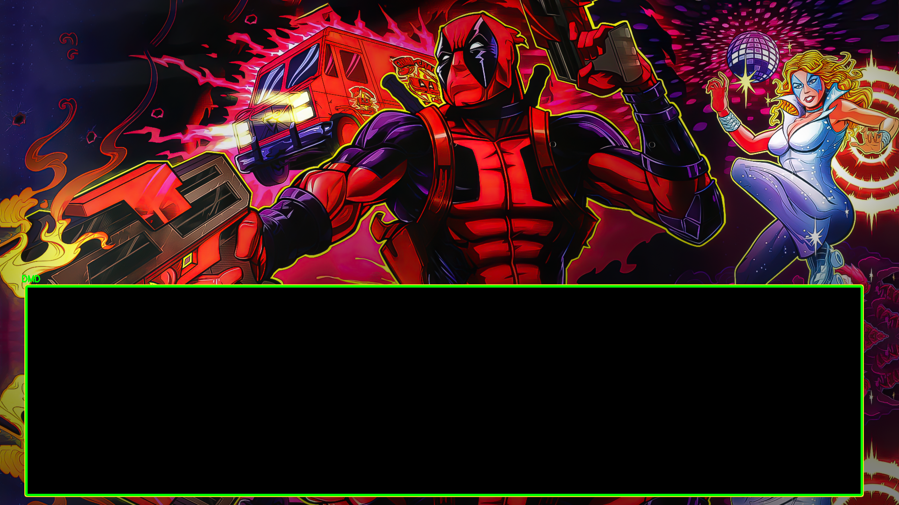
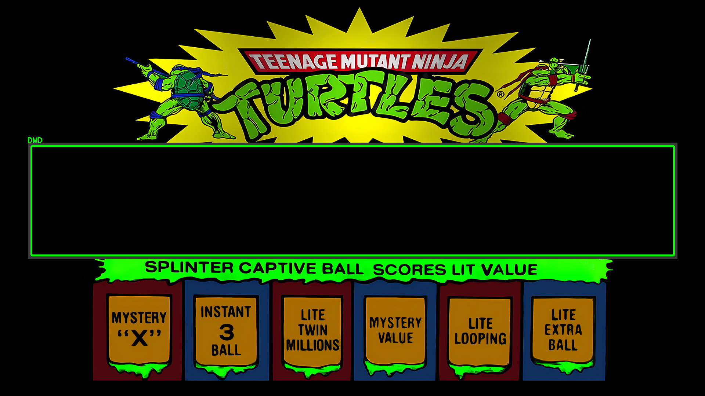
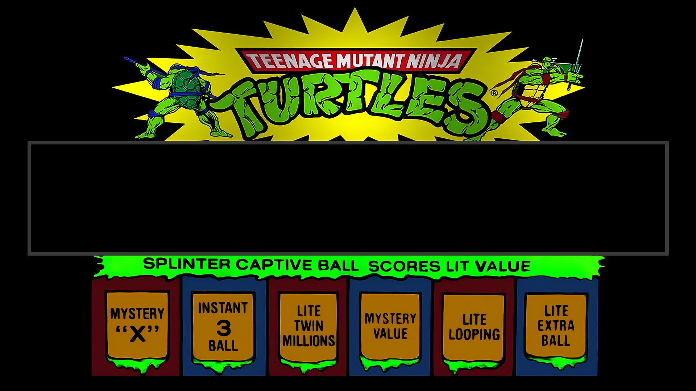

# DMD Config

A tool to analyze DirectB2S FullDMD files and automatically generate DMD (Dot Matrix Display) placement configurations for your virtual pinball cabinet.

## Features

- Automatic DMD placement analysis for DirectB2S files
- Support for multiple table processing
- Visual display of DMD placement results
- Image extraction from DirectB2S files
- Configurable settings via YAML

## Installation

1. Clone the repository:
```bash
git clone https://github.com/Le-Syl21/dmd-config.git
cd dmd-config
```

2. Create and activate a Python virtual environment:
```bash
python3 -m venv --upgrade-deps venv
source venv/bin/activate
```

3. Install dependencies:
```bash
pip install --require-virtualenv --requirement requirements.pip
```

## Configuration

- Modify `DMD_config.yaml` to match your PinCab setup
- Adjust DMD discovery filter settings if needed for some specific tables (DMD_config.yaml as comments)

## Usage

First, activate the virtual environment:
```bash
source venv/bin/activate
```

### Basic Commands

View available options:
```bash
./DMD_config.py --help
```

Process a single table:
```bash
./DMD_config.py path/to/table/table.directb2s
```

Process multiple tables:
```bash
./DMD_config.py path/to/tables/*/*.directb2s
```

When finished, deactivate the virtual environment:
```bash
deactivate
```

### Command Line Options

```
usage: DMD_config.py [-h] [-d] [-s] [-c CONFIG] files [files ...]

DMD Configuration Generator

positional arguments:
  files                 DirectB2S files to process

options:
  -h, --help                     show this help message and exit
  -d, --display                  Display result of DMD placement
  -s, --save                     Save all images found in DirectB2S
  -c CONFIG, --config CONFIG     Path to screen configuration YAML file
```

## Example Results

### Display Mode (`--display`)

#### DeadPool



#### TMNT


### Save Mode (`--save`)

#### DeadPool


#### TMNT



## Author

- [@Le-Syl21](https://github.com/Le-Syl21)

## Contributing

Contributions are welcome! Please feel free to submit a Pull Request.
